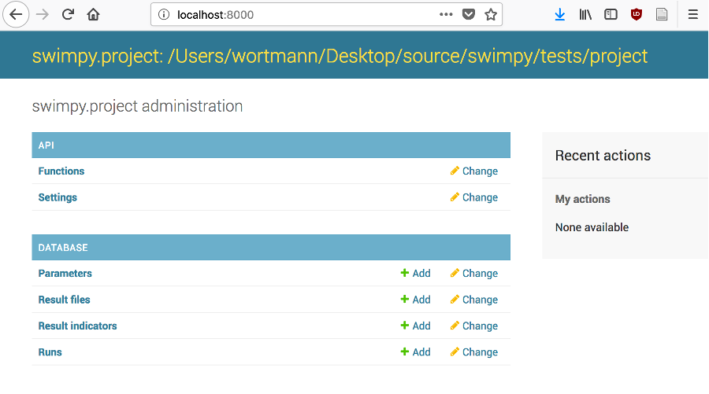
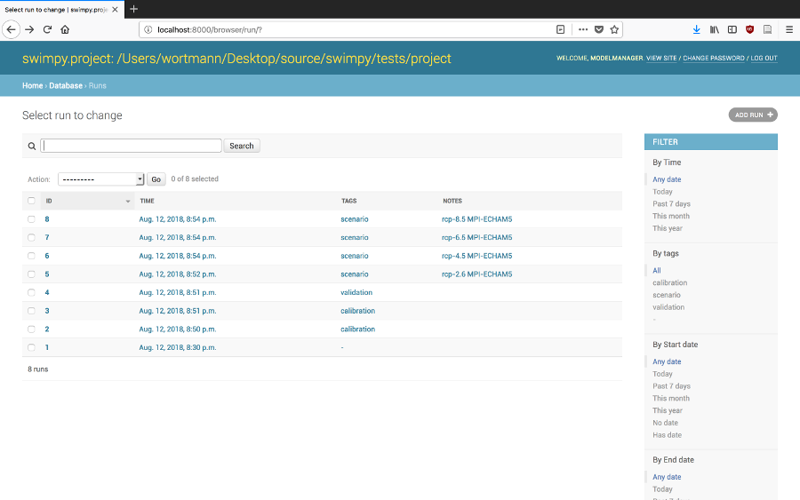
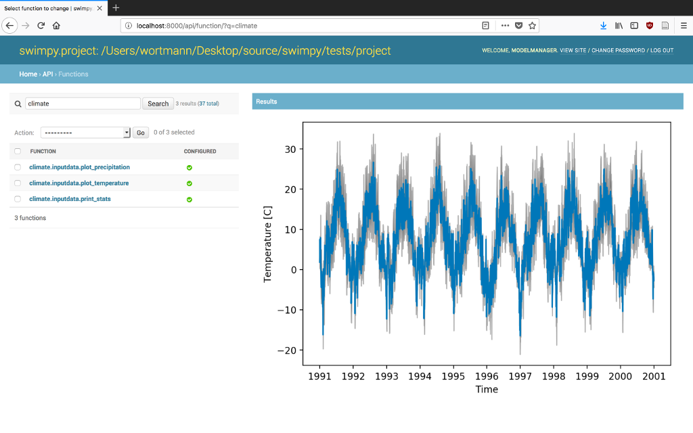

=====
Usage
=====

Quick start
-----------
Setup the SWIMpy resource in your SWIM project directory:

.. code-block:: console

    $ cd change/to/your/swimproject
    $ swimpy setup
    $ swimpy -h

Now you can use this project through the `commandline interface`_, the
`python API`_ or the `browser interface`_. The SWIMpy resources and settings
are located in the `swimpy` directory of your project. Most importantly, the
`settings.py` file controls the configuration of your project. By default, this
is empty, but you are encouraged to add variables and functions relevant for
your project (see `Project settings`_).

Commandline interface
---------------------
All implemented `project` functions are available at the commandline where the
SWIMpy resources are located. Help is available for every function including
the function arguments and doc-strings:

.. code-block:: console

    $ swimpy --help                 # all available functions and plugins
    $ swimpy run --help             # calling/help on particular functions
    $ swimpy browser start  --help  # calling/help on plugin functions

This is useful for quick access to SWIMpy functionality or for use in
`Makefiles`. For example, running SWIM and saving its output with notes and tags
to the database.

.. code-block:: console

    $ swimpy run --notes='A test run with XYZ.' --tags=test

Arguments are first parsed as Python code and if that fails as strings.

Python API
----------
The SWIMpy project is loaded by instantiating the swimpy.Project, either in the
current directory or with a path to the project directory:

.. code-block:: python

    import swimpy

    project = swimpy.Project()
    project = swimpy.Project('path/to/project')

    # get and set parameters like dictionaries
    ecal = project.basin_parameters['ecal']
    project.config_parameters['nbyr'] = 20

    # run and save
    run = project.run(notes='test run', files=['station_daily_discharge'])

    # plot results from project
    project.station_daily_discharge.plot()

    # or plot saved result
    run.station_daily_discharge.plot()

Check out the :ref:`examples:Examples`.

Browser interface
-----------------

Start the browser interface from the commandline:

.. code-block:: console

  $ swimpy browser start

Now navigate with your browser of choice to: ``http://localhost:8000``

*API and runs database tables on home page*

*List of runs*

*An executed function with a figure output*

Project settings
----------------
The `settings.py` file in the SWIMpy resource directory is the place to
customise your project. Everything defined here will become available with the
the `project` instance in python, while functions and plugins are also available
in the commandline and browser interfaces. Some rules apply:

1) Modules and any names starting with an _ (underscore) are ignored and is
   only used in the settings.py file. E.g.:

   .. code-block:: python

    import os   # ignored
    from modelmanager.utils import propertyplugin as _propertyplugin  # ignored

    _somevariable = 123  # ignored

    def _quick_function(e):
        return 'ignored'

2) Classes (i.e. plugins) will be instantiated on load with the project as
   the only argument. E.g.:

   .. code-block:: python

    # in settings.py
    class myplugin:
        def __init__(self, project):
            self.project = project
        def hello(self):
            return 'Hello ' + self.project.resourcedir

    # in Python API
    project = swimpy.Project()
    project.myplugin.hello()

3) Default values can be overridden or disabled. E.g.:

  .. code-block:: python

    browser = None  # disabled loading/use

  Or more complex subclassing/overriding:

  .. code-block:: python

    from modelmanager.utils import propertyplugin as _propertyplugin
    from swimpy import output

    @_propertyplugin
    class station_daily_discharge(output.station_daily_discharge):
        """Return 1-10 instead of reading station discharge."""
        @staticmethod
        def from_project(path, **kwargs):
            return range(1,10+1)

4) Python properties will be attached to the project class and executed when
   accessed. Property-plugins (from ``modelmanager.utils.propertyplugin``) will
   be instantiated on use (e.g. see the ``input.py`` and ``output.py`` modules).

5) Note that the settings are loaded from various locations,
   i.e. dont rely on relative paths. It's best to use dynamic or absolute
   paths. For example, the path to the swimpy resource or the project directory
   can be obtained like this:

   .. code-block:: python

     import os.path as osp
     _here = osp.dirname(__file__)
     _projectdir = osp.dirname(_here)

.. commandline interface: #commandline-interface
.. python API: #python-api
.. browser interface: #browser-interface
.. Settings: #settings
